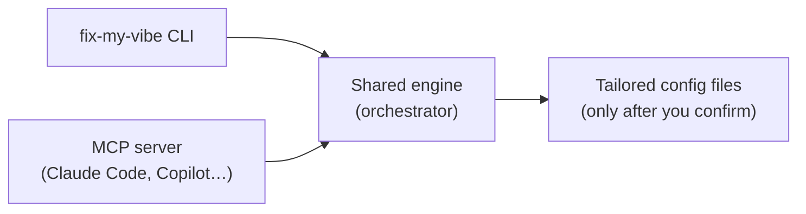
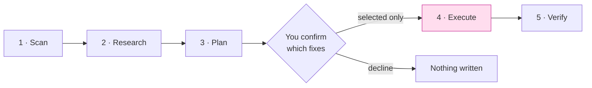
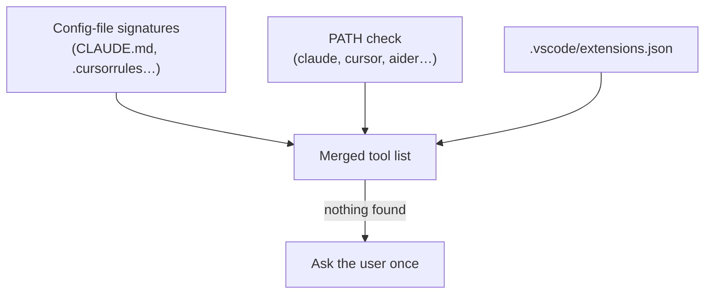
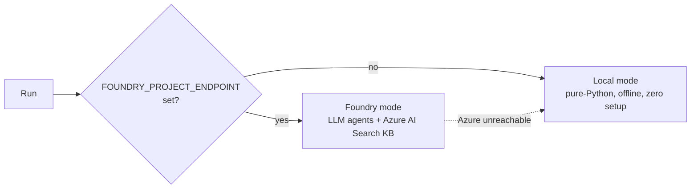

# Fix My Vibe

> An MCP server (and CLI) that diagnoses and fixes your AI coding tool setup —
> right inside the editor you already use.

AI coding assistants only work as well as their setup files — and most projects
never get good ones. **Fix My Vibe** scans a project, works out which AI coding
tools are in use (Claude Code, Cursor, Copilot, Windsurf, Aider), finds what's
missing or misconfigured, and generates the right config files for your stack —
**writing nothing to disk until you confirm exactly which fixes to apply.**

It runs as an **MCP server**, so an agent like Claude Code or Copilot Chat can
call it as a set of tools and do the work in place. The same engine also ships as
a standalone `fix-my-vibe` CLI.

<!-- DEMO: 60–90s hero video — "fix my vibe" in Claude Code, end to end. -->
<!--  -->
> 📹 **Demo video placeholder** — see [`docs/media/README.md`](docs/media/README.md)
> for the asset list. Hero clip: ask Claude Code to *"fix my vibe"* → scan →
> checkboxes → files written → verified.

---

## Why it's different

- **It lives where you already work.** As an MCP server, there's no separate app —
  you just talk to your agent and it fixes things in place.
- **One engine, two front doors.** The CLI and the MCP server share the exact same
  orchestrator. Planning *can never* write files; applying is the only writer.
- **Confirmation built into the protocol.** `apply_fixes` uses an MCP elicitation
  prompt (one checkbox per fix) as its confirmation gate. Tick what you want; the
  rest is never written. No interactive channel → nothing is written.
- **Grounded, not guessed.** In Foundry mode, advice is backed by a curated
  knowledge base of authoritative sources (OWASP / CWE / NIST) via Azure AI Search —
  not just the model's memory.
- **It catches AI-introduced bugs.** The scanner specifically looks for patterns AI
  assistants commonly introduce — hardcoded secrets, `eval()`, SQL string
  interpolation, disabled TLS verification, `debug=True`, `shell=True`.
- **It degrades gracefully.** Works fully offline in local mode; gets smarter when
  you plug in Azure.

---

## How it works

Two front doors, one shared engine:



The engine runs a five-stage pipeline. A single confirmation gate sits between
reasoning and writing — everything left of it is read-only.



| Stage | Role | Touches disk? |
|-------|------|:---:|
| **Scan** | Detect AI tools, stack, and security issues | reads only |
| **Research** | Look up current best practices (KB + web) | no |
| **Plan** | Rank issues, generate the exact file content | no |
| **Execute** | Write the confirmed files (with `.bak` backups) | **writes** |
| **Verify** | Confirm written files contain the expected sections | reads only |

Tool detection itself runs in layers, so a tool is found whether it left a config
file, is installed on `PATH`, or is only a VS Code recommendation:



<!-- DEMO: GIF of `claude mcp add` + `claude mcp list` showing Connected. -->
> 🎬 **MCP setup GIF placeholder** — `docs/media/mcp-setup.gif`

---

## Quick start

### As a CLI

```bash
pip install -e .
fix-my-vibe /path/to/your/project          # auto: Foundry if configured, else local
fix-my-vibe /path/to/your/project --local  # force offline local mode
```

| Flag | Effect |
|------|--------|
| `--local` | Run without Azure Foundry (pure-Python reasoning, offline) |
| `--scan-only` | Diagnose only — no planning, no writes |
| `--yes` | Auto-confirm all actions (non-interactive / CI) |
| `--verbose` | Print full agent output (and reasoning traces in Foundry mode) |
| `--json` | Emit the final result as JSON |

### As an MCP server (Claude Code)

```bash
pip install -e .
claude mcp add fix-my-vibe -- fix-my-vibe-mcp
claude mcp list          # fix-my-vibe should show ✔ Connected
```

Then, in a fresh Claude Code session, just ask:

> *"Use fix-my-vibe to scan /path/to/project"* → read-only diagnosis
> *"…propose fixes for /path/to/project"* → full plan, still no writes
> *"…apply fixes to /path/to/project"* → checkbox prompt, writes only what you tick

The server exposes three tools:

| Tool | Writes? | Purpose |
|------|:---:|---------|
| `scan_project` | No | Read-only diagnosis (detected tools, stack, security findings) |
| `propose_fixes` | No | Full ranked plan with complete file content (dry run) |
| `apply_fixes` | **Yes** | Confirm via checkboxes, then write only the selected files |

See [`docs/MCP_SERVER.md`](docs/MCP_SERVER.md) for registration scope, transport
choices, and a full interactive test script.

<!-- DEMO: screenshot of the elicitation checkbox prompt. -->
> 🖼️ **Screenshot placeholder** — `docs/media/elicitation-prompt.png` (the
> confirmation checkboxes — the safety gate in action).

---

## Running modes



- **Local mode** needs no configuration and runs anywhere. Detection, security
  scanning, planning, and the confirmation gate all work offline using built-in
  best-practice content.
- **Foundry mode** runs the five agents as real LLM-powered reasoning agents on
  Azure AI Foundry and grounds advice in a curated Azure AI Search knowledge base
  (OWASP / CWE / NIST + framework docs), with Tavily web search as a fallback.

### Configuring Foundry mode

1. Copy `.env.example` to `.env` and fill in the `FOUNDRY_*` and `AZURE_SEARCH_*`
   values (see the comments in that file for what each is for).
2. Authenticate: `az login` (auth uses `DefaultAzureCredential`).
3. Verify the connection: `python test_connection.py`.
4. Run `fix-my-vibe <path>` — it auto-detects Foundry mode and falls back to local
   if Azure is unreachable.

The knowledge base is built by a real ingestion pipeline
(`kb/ingest_security_kb.py`: fetch → chunk → embed → index). See
[`kb/AZURE_SEARCH_README.md`](kb/AZURE_SEARCH_README.md).

---

## Safety guarantees

These are enforced in code (and covered by the test suite), not just documented:

- **Never writes without explicit confirmation.** Only the Execute stage writes,
  and only for confirmed actions. No confirmation channel → nothing is written.
- **Backs up before overwriting.** Any existing file is copied to `<name>.bak`
  first.
- **Never escapes the target directory.** All writes are path-traversal checked.

---

## Development

```bash
pip install -e ".[dev]"
pytest
```

The suite (`tests/`) covers detection, the security scanner, file-I/O safety
(path traversal, backups), and the orchestrator's confirmation gate end to end —
all offline, no Azure required. Sample projects live in `tests/fixtures/`.

---

## Project layout

```
src/
  agents/      scanner · researcher · planner · executor · verifier
  tools/       detection · fs_tools · security_scan · mcp_catalog
  orchestrator.py   shared plan/apply phases (CLI + MCP)
  cli.py            fix-my-vibe entry point
  mcp_server.py     fix-my-vibe-mcp entry point (FastMCP, stdio)
kb/            knowledge-base sources + ingestion pipeline
infra/         azd / Bicep provisioning for Azure resources
tests/         pytest suite + fixture projects
docs/          architecture notes, MCP server guide, demo media
```

## Stack

- Python 3.11+
- MCP Python SDK (FastMCP, stdio transport)
- Azure AI Foundry (Microsoft Agent Framework) — optional, for Foundry mode
- Azure AI Search — grounded knowledge base (optional)
- Tavily — web-search fallback (optional)
- Filesystem only — no GitHub ingestion, no external database
