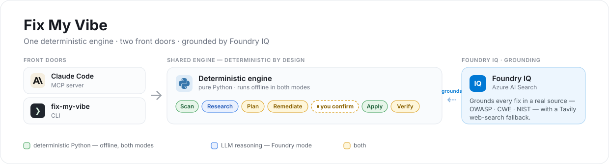
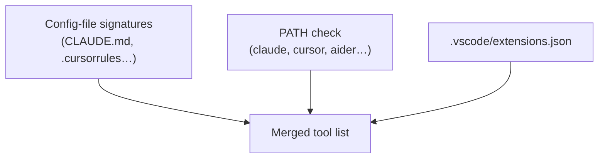
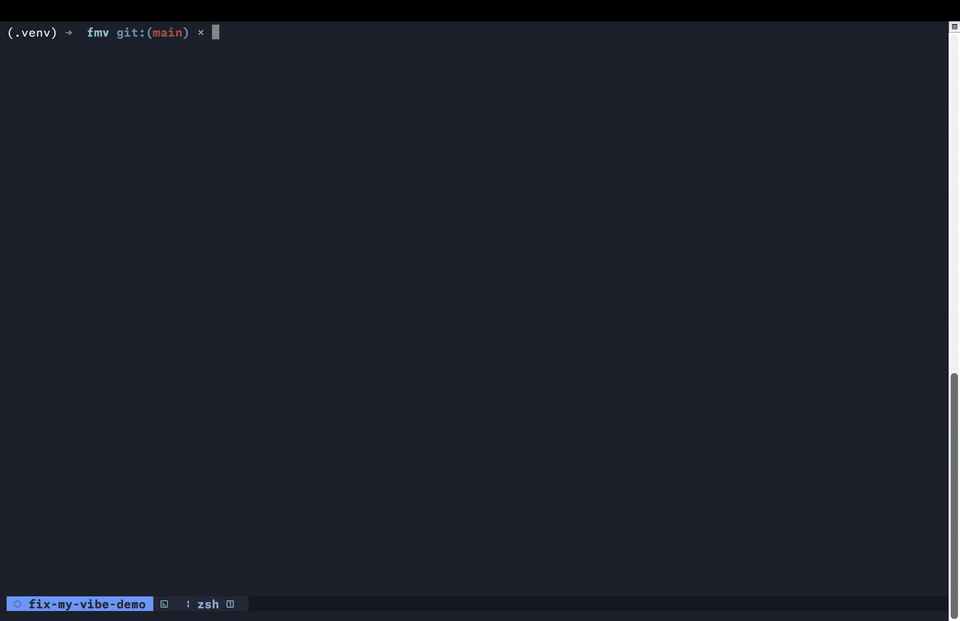
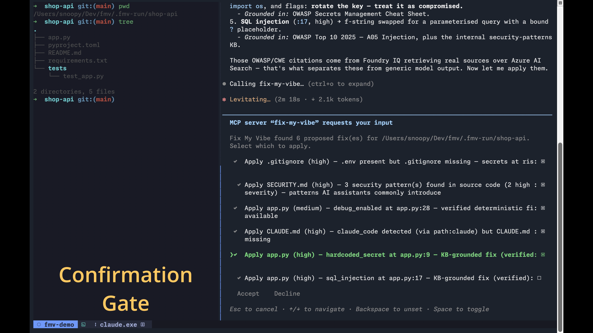
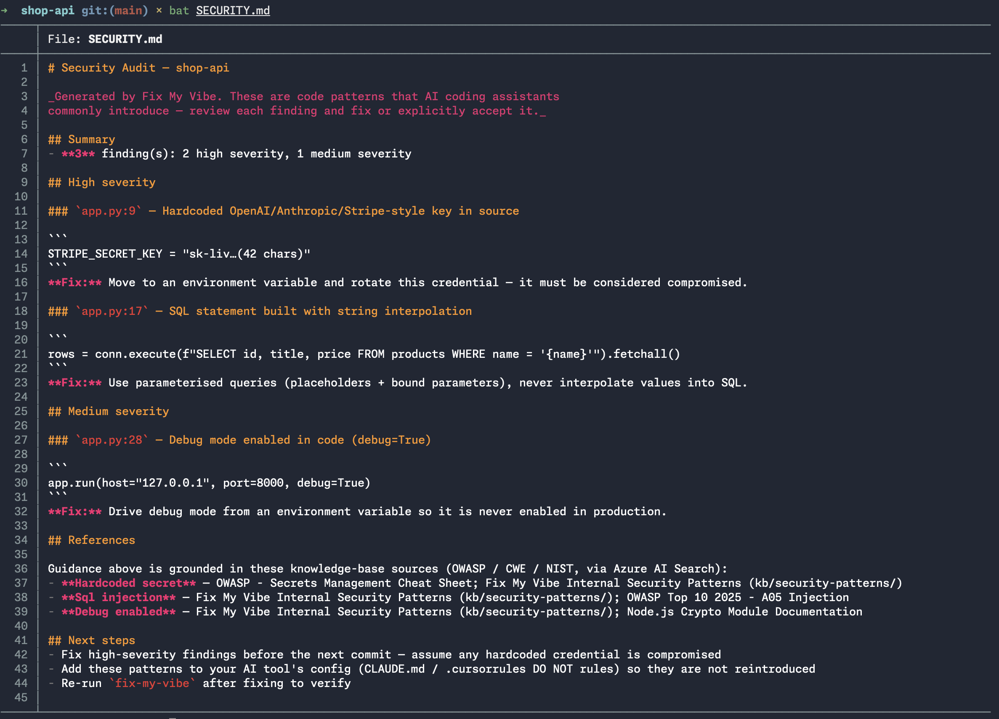
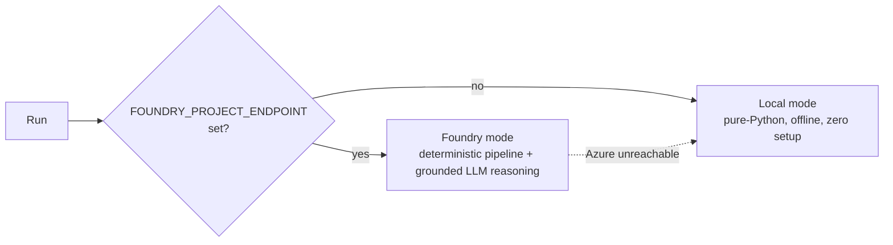

# Fix My Vibe

[](https://github.com/njranum/Fix-My-Vibe/actions/workflows/ci.yml)

> An MCP server (and CLI) that diagnoses and fixes your AI-coding setup — and the
> security bugs AI assistants leave in your code — right inside the editor you already use.

AI coding assistants only work as well as their setup files, and most projects never get
good ones. **Fix My Vibe** scans a project, works out which AI coding tools are in use
(Claude Code, Cursor, Copilot, Windsurf, Aider), finds what's missing or misconfigured,
generates the right config files for your stack, and repairs the security issues AI
assistants routinely introduce — **writing nothing to disk until you confirm exactly which
fixes to apply.**

It runs as an **MCP server**, so an agent like Claude Code or Copilot Chat can call it as a
set of tools and do the work in place. The same engine also ships as a standalone
`fix-my-vibe` CLI.

<!-- HERO VIDEO — hosted on GitHub's asset CDN (the URL below auto-embeds a player). To
     replace it, upload a new docs/media/demo-e2e.mp4 via a PR/issue comment and swap the URL. -->

https://github.com/user-attachments/assets/8b681791-c1e6-48b1-ac96-1f5fdc691284

> 📹 **Demo video** — an 80-second end-to-end run: ask Claude Code to *"fix my vibe"* on a
> messy project → scan → a ranked plan with OWASP citations → a confirmation checkbox per
> fix → only the ticked fixes written → verified.

**Contents:** [Why it's different](#why-its-different) · [How it works](#how-it-works) · [Quick start](#quick-start) · [What it generates](#what-it-generates) · [Running modes](#running-modes) · [Performance](#performance) · [Safety](#safety-guarantees) · [Development](#development)

---

## Why it's different

- **It lives where you already work.** As an MCP server, there's no separate app — you just
  talk to your agent and it fixes things in place.
- **Deterministic where it should be, AI where it counts.** The mechanical work — detecting
  tools, scanning for security issues, generating config files, and writing them — is pure
  Python and runs offline in seconds. The LLM is reserved for the parts that genuinely
  reason: which best practices to pull from the knowledge base, how to prioritise fixes,
  semantic code repairs, and qualitative verification. Moving the boilerplate out of the
  model cut an end-to-end cloud run from **~8m51s to ~1m38s**.
- **One engine, two front doors.** The CLI and the MCP server share the exact same
  orchestrator. Planning *can never* write files; applying is the only writer.
- **Confirmation built into the protocol.** `apply_fixes` uses an MCP elicitation prompt
  (one checkbox per fix) as its confirmation gate — and code edits default to *unchecked*.
  Tick what you want; the rest is never written. No interactive channel → nothing is written.
- **It fixes code, not just flags it.** Beyond config, it repairs the security bugs AI
  assistants commonly introduce — hardcoded secrets, `eval()`/`exec()`, SQL string
  interpolation, disabled TLS verification, `debug=True`, `shell=True`. Mechanical cases are
  fixed deterministically offline; semantic ones are grounded in the knowledge base. Every
  edit is a confirmed diff, backed up, and re-verified — and `--undo` rolls it all back.
- **Grounded, not guessed — Foundry IQ.** In Foundry mode, advice and code fixes are backed
  by a curated knowledge base of authoritative sources (OWASP / CWE / NIST) retrieved over
  Azure AI Search — **Foundry IQ** grounding each fix in a real source, not the model's memory.
- **It degrades gracefully.** Fully offline in local mode; smarter when you plug in Azure,
  and it falls back to local automatically if Azure is unreachable.

---

## How it works

Two front doors, one shared engine — deterministic Python throughout, with the LLM used
only where it genuinely reasons:



The engine runs a read-only pipeline; a single confirmation gate sits between it and any
writes. **Most stages are deterministic Python — only some call the LLM, and only in
Foundry mode** (🟩 deterministic Python, offline · 🟦 LLM reasoning, Foundry · 🟨 both):

| Stage | What it does | Engine | Touches disk? |
|-------|--------------|--------|:---:|
| **Scan** | Detect AI tools, stack, and security issues | deterministic (both modes) | reads only |
| **Research** | Look up current best practices | KB + LLM *(Foundry)* · static *(local)* | no |
| **Plan** | Rank issues, generate the exact file content | deterministic content; LLM *rationale* *(Foundry)* | no |
| **Remediate** | Propose code patches for findings | deterministic for mechanical cases; KB + LLM for semantic ones *(Foundry)* | no |
| **Apply** | Write the confirmed files & code edits (with `.bak` backups) | deterministic | **writes** |
| **Verify** | Confirm files parse, findings cleared, sections present | deterministic; LLM qualitative check *(Foundry)* | reads only |

Tool detection runs in layers, so a tool is found whether it left a config file, is
installed on `PATH`, or is only a VS Code recommendation:





---

## Quick start

### As a CLI

```bash
pip install -e .
fix-my-vibe /path/to/your/project          # auto: Foundry if configured, else local
fix-my-vibe /path/to/your/project --local  # force offline local mode
```

| Flag | Effect |
|------|--------|
| `--local` | Run without Azure Foundry (pure-Python, offline) |
| `--scan-only` | Diagnose only — no planning, no writes |
| `--yes` | Auto-confirm all actions (non-interactive / CI) |
| `--undo` | Restore files from the `.bak` backups of a previous run |
| `--verbose` | Print full agent output (and reasoning traces in Foundry mode) |
| `--trace` | Write per-phase timing to `.fmv-traces/` (also via `FMV_TRACE=1`) |
| `--json` | Emit the final result as JSON |

### As an MCP server (Claude Code)

```bash
pip install -e .
claude mcp add fix-my-vibe -- fix-my-vibe-mcp
claude mcp list          # fix-my-vibe should show ✔ Connected
```

Then, in a fresh Claude Code session, just ask:

> *"Use fix-my-vibe to scan /path/to/project"* → read-only diagnosis
> *"…propose fixes for /path/to/project"* → full plan, still no writes
> *"…apply fixes to /path/to/project"* → checkbox prompt, writes only what you tick

The server exposes three tools:

| Tool | Writes? | Purpose |
|------|:---:|---------|
| `scan_project` | No | Read-only diagnosis (detected tools, stack, security findings) |
| `propose_fixes` | No | Full ranked plan with complete file content (dry run) |
| `apply_fixes` | **Yes** | Confirm via checkboxes, then write only the selected fixes |

`apply_fixes` reuses the plan `propose_fixes` already computed (cached per project), so it
doesn't re-run the pipeline. See [`docs/MCP_SERVER.md`](docs/MCP_SERVER.md) for registration
scope, transport choices, and a full interactive test script.



Tick the fixes you want; the rest is never written. If the client doesn't support
elicitation, `apply_fixes` writes **nothing** and returns `needs_review`.

---

## What it generates

When you confirm, Fix My Vibe writes only the fixes you tick — a mix of new files and
in-place code edits:

- **`CLAUDE.md`** — the missing Claude Code guidance file: project overview, stack, test
  command, recommended MCP servers, and DO-NOT rules.
- **`.cursorrules` / `.cursorignore`** — Cursor equivalents, when Cursor is detected.
- **`SECURITY.md`** — a written audit of the code findings, each with its OWASP / CWE
  reference (retrieved from the knowledge base in Foundry mode).
- **`.gitignore`** — stops `.env`, keys, and `.pem`/`.key` files from being committed.
- **In-place code fixes** — each applied as a confirmed diff over the original, with a
  timestamped `.bak` backup.



---

## Running modes



- **Local mode** needs no configuration and runs anywhere. Detection, security scanning,
  planning, file generation, the mechanical code fixes (e.g. `debug=True` → `False`,
  `verify=False` → `True`), the confirmation gate, and verification all run offline with no
  LLM and no network — as does the full MCP `scan` / `propose` / `apply` flow.
- **Foundry mode** is that *same* deterministic pipeline, plus the LLM used only where it
  reasons: the **Researcher** (choosing and grounding best practices in the **Foundry IQ**
  knowledge base over Azure AI Search, with Tavily web search as a fallback), the **semantic code remediation**
  (SQL injection, hardcoded secrets, `eval`/`exec`, `shell=True`), the **Planner's
  prioritisation rationale**, and a **qualitative verification** pass. It engages
  automatically when `FOUNDRY_PROJECT_ENDPOINT` is set.

In other words, Foundry mode is *local mode plus grounded reasoning on the parts that
actually reason* — not "everything through the model."

### Configuring Foundry mode

1. Copy `.env.example` to `.env` and fill in the `FOUNDRY_*` and `AZURE_SEARCH_*` values
   (see the comments in that file for what each is for).
2. Authenticate: `az login` (auth uses `DefaultAzureCredential`).
3. Verify the connection: `python test_connection.py`.
4. Run `fix-my-vibe <path>` — it auto-detects Foundry mode and falls back to local if Azure
   is unreachable.

The knowledge base is built by a real ingestion pipeline (`kb/ingest_security_kb.py`: fetch
→ chunk → embed → index) over 32 curated sources (OWASP / CWE / NIST + framework docs). See
[`kb/AZURE_SEARCH_README.md`](kb/AZURE_SEARCH_README.md).

---

## Performance

The deterministic-first design isn't just cleaner — it's much faster, and it's measured, not
guessed:

- On an instrumented demo project, moving the mechanical work out of the LLM cut an
  end-to-end Foundry run from **8m51s → 1m38s** (−82%). Per-phase timings are saved to
  `.fmv-traces/` with `--trace`.
- The MCP server **caches the plan**: `propose_fixes` computes it once and `apply_fixes`
  reuses it (≈155s → ~0s on an unchanged project), keyed by a file signature that
  invalidates the moment anything in the project changes.

*Caveats, honestly:* the headline number is measured on a small fixture — real-world time
scales with project size, and the semantic remediator is a non-deterministic LLM, so the
number of code fixes can vary between runs on the same project.

---

## Safety guarantees

These are enforced in code (and covered by the test suite), not just documented:

- **Never writes without explicit confirmation.** Only the Apply stage writes, and only for
  confirmed fixes. No confirmation channel → nothing is written. Code edits default to
  unchecked.
- **Backs up before overwriting.** Existing files are copied to `<name>.bak` first, and code
  fixes use *versioned* backups (`.bak`, `.bak.1`, …) so a second run never destroys the
  pristine original.
- **Undo.** `fix-my-vibe <path> --undo` restores files from their oldest (pristine) backups.
- **Never escapes the target directory.** All writes are path-traversal checked.
- **Patches are proven before they're offered.** Every code fix must parse, clear the
  finding, introduce no new findings, and is relocated by content (not a stale line number)
  — or it's dropped rather than applied blind.

---

## Development

```bash
pip install -e ".[dev]"
pytest
```

The suite (`tests/`) covers detection, the security scanner, file-I/O safety (path
traversal, backups), and the orchestrator's confirmation gate end to end — all offline, no
Azure required. Sample projects live in `tests/fixtures/`.

---

## Project layout

```
src/
  agents/      scanner · researcher · planner · remediator · executor · verifier
  tools/       detection · fs_tools · security_scan · code_fixes · remediation · mcp_catalog
  orchestrator.py   shared plan/apply phases (CLI + MCP)
  cli.py            fix-my-vibe entry point
  mcp_server.py     fix-my-vibe-mcp entry point (FastMCP, stdio)
kb/            knowledge-base sources + ingestion pipeline
infra/         azd / Bicep provisioning for Azure resources
tests/         pytest suite + fixture projects
docs/          architecture notes, MCP server guide, demo media
```

## Stack

- Python 3.11+
- MCP Python SDK (FastMCP, stdio transport)
- Azure AI Foundry (Microsoft Agent Framework) — optional, for Foundry-mode reasoning
- Azure AI Search — grounded knowledge base (optional)
- Tavily — web-search fallback (optional)
- Filesystem only — no GitHub ingestion, no external database
